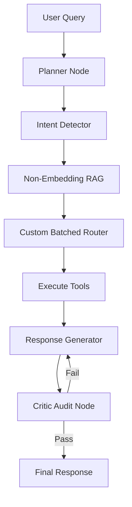

# 🤖 Generic AI Agent for Orders & Scheduling

A high-performance, generic Python backend framework for AI agents capable of handling **Orders**, **Scheduling**, and **Q&A** for any small business. 

Simply input one PDF describing the business (menu, services, policies), and the agent automatically configures itself to handle real customer interactions.

---

## 🏗️ Architecture Overview

The agent is built using **LangGraph** as a directed state machine, ensuring complex multi-intent messages are handled with standard business logic.

### Multi-Node Agentic Pipeline



| Node                | Description                                                         |
| :------------------ | :------------------------------------------------------------------ |
| **Planner**         | Generates an internal strategy before acting.                       |
| **Intent Detector** | Identifies multiple intents (e.g., "Add a pizza AND book a table"). |
| **RAG Retrieval**   | LLM-based retrieval without vector embeddings/indexes.              |
| **Custom Router**   | Batched tool detection (not LangChain's default).                   |
| **Critic**          | Validates the response against PDF rules before sending.            |

---

## ✨ Key Features

- **🚀 Generic Implementation**: Works for any business (Pizza shop, Dental Clinic, Dry Cleaner).
- **🧠 Knowledge Enrichment**: Automatically generates supplementary FAQ and "skills" articles that aren't in the original PDF.
- **📊 Synthetic CRM**: Simulates realistic customer data, order history, and family members for testing purposes.
- **📅 Intelligent Scheduling**: Parses natural dates ("next Friday at 2pm") and checks provider availability.
- **🛒 Cart Management**: Full order lifecycles including modifiers (e.g., "extra cheese"), address validation, and loyalty points.
- **🔍 Non-Embedding RAG**: Uses LLM logic to match query topics to document paragraphs for clinical accuracy.

---

## 🛠️ Tech Stack

- **Framework**: LangGraph, LangChain
- **LLM**: OpenAI GPT-4o-mini (Primary), Google Gemini 2.0 (Fallback)
- **Database**: SQLite (11 tables)
- **Utilities**: PyMuPDF (PDF parsing), Faker (Synthetic data), Geopy (Address validation)

---

## 💻 Windows Setup Guide

### 1. Prerequisites
- **Python 3.11+**
- **Git** (optional)
- An **OpenAI** or **Gemini** API Key

### 2. Installation
Open PowerShell in the project directory:

```powershell
# 1. Create and activate virtual environment
python -m venv venv
.\venv\Scripts\activate

# 2. Install dependencies
pip install -r requirements.txt

# 3. Configure API keys
copy .env.example .env
# Edit .env and add your GEMINI_API_KEY or OPENAI_API_KEY
```

### 3. Running the Agent (CLI)
```powershell
# Start the interactive assistant
python main.py

# Or load a specific business description
python main.py --pdf sample_pdfs/mario_pizza.md
```

### 4. Running the API Server
```powershell
python app/server.py
# Access documentation at http://localhost:8000/docs
```

---

## 📂 Project Structure

```bash
agent/
├── main.py                     # Main CLI entry point
├── agent/
│   ├── agent.py                # LangGraph definition (7 nodes)
│   ├── tools.py                # 26 modular agent tools
│   └── rag_engine.py           # LLM-only retrieval logic
├── core/
│   ├── database.py             # SQLite schema & Synthetic data
│   ├── llm_client.py           # Unified model wrapper
│   └── logger.py               # Detailed calculation logging
├── processing/
│   ├── pdf_processor.py        # Structural chunking logic
│   └── knowledge_enricher.py   # LLM "Skills" generator
└── sample_pdfs/                # Pre-loaded business examples
```

---

## 📝 Testing & Validation

### Smoke Tests (Full Integration)

Run the automated smoke test to verify the system's performance on multiple business types:

```powershell
# Run all scenarios (restaurant, appointment, conflicts, etc.)
python tests/smoke_test.py

# Run a specific scenario only
python tests/smoke_test.py --suite restaurant
python tests/smoke_test.py --suite tools
python tests/smoke_test.py --suite appointment conflict

# Keep test DB files after run (for debugging)
python tests/smoke_test.py --keep-db
```

**Available suites:** `restaurant`, `dry_cleaner`, `appointment`, `info`, `mixed`, `conflict`, `db_integrity`, `loyalty`, `tools`

The smoke test validates:
- PDF ingestion & enrichment
- Synthetic user creation
- Multi-turn chat logic
- Cart operations (add, remove, confirm)
- Appointment booking, reschedule, cancel
- Conflict detection (4 PM blocks 4:30 PM)
- Tools & calculation (multi-item add, typo tolerance, confirm grounding)

**Requirements:** Set `GEMINI_API_KEY` or `OPENAI_API_KEY` in `.env`.

---

### Direct Tool Tests (Unit)

Run fast, deterministic unit tests for tools (no LLM calls for `view_cart`, `confirm_order`, `get_order_history`):

```powershell
# Standalone (no pytest required)
python tests/test_tools_comprehensive.py

# With pytest
python -m pytest tests/test_tools_comprehensive.py -v
```

These tests verify:
- `view_cart` (empty and with items)
- `confirm_order` (creates order, clears cart, returns correct structure)
- `confirm_order` rejection for appointment businesses
- `get_order_history` after order confirmation

---
*Developed for Hammad Nasir - Generic AI Agent Project*
