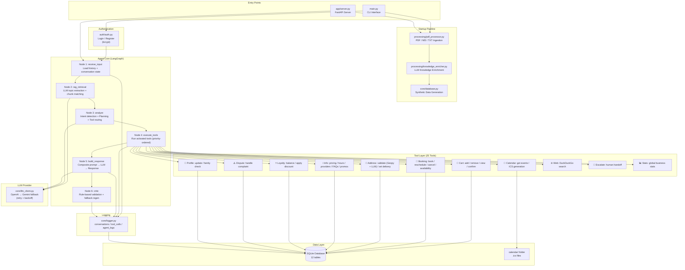
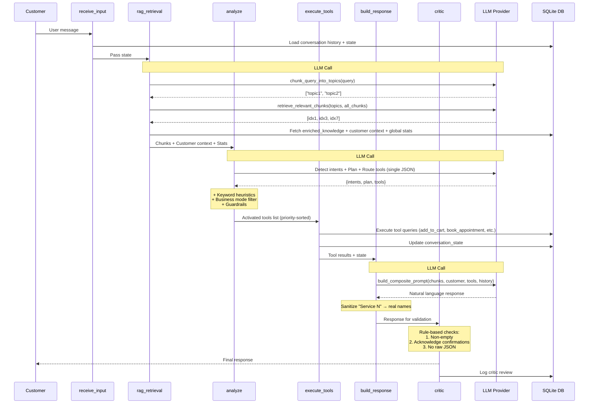
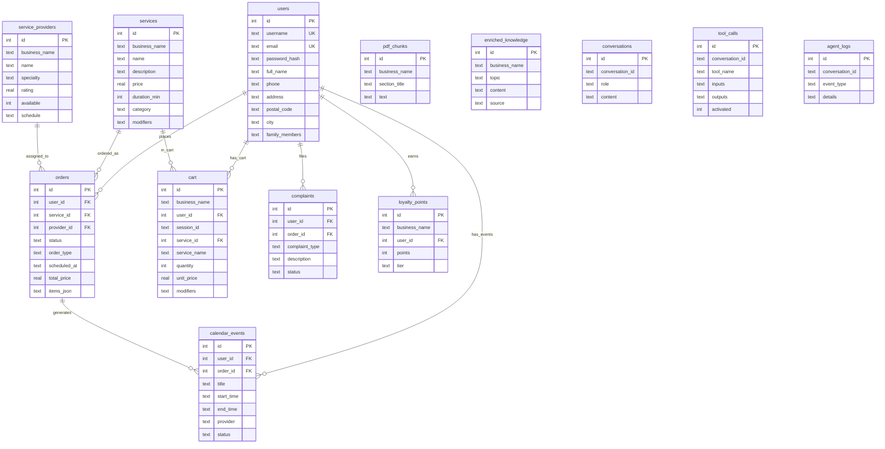
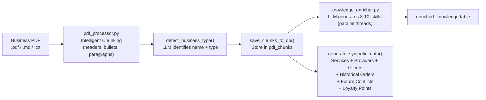

# Generic AI Agent — Architecture Diagram & Requirements Audit

---

## 1. System Architecture — High-Level Overview

---

## 2. LangGraph Agent Pipeline — Detailed Flow

---

## 3. Database Schema Diagram

---

## 4. Startup Pipeline

---

## 5. File-Level Module Map

| Module       | File                  | Lines | Purpose                                                              |
| ------------ | --------------------- | ----: | -------------------------------------------------------------------- |
| **Entry**    | main.py               |   262 | CLI entrypoint, startup pipeline, conversation loop                  |
| **API**      | server.py             |   192 | FastAPI server: `/agent/chat`, `/health`, `/business/load_pdf`       |
| **Agent**    | agent.py              |   692 | LangGraph state machine: 6 nodes, intent detection, planning, critic |
| **RAG**      | rag_engine.py         |   399 | LLM-only RAG: topic chunking, relevance matching, composite prompt   |
| **Tools**    | tools.py              |  1674 | 25 registered tools covering orders, booking, address, loyalty, etc. |
| **Database** | database.py           |   708 | SQLite schema, synthetic data, conversation state persistence        |
| **LLM**      | llm_client.py         |   149 | OpenAI primary → Gemini fallback with retry/backoff                  |
| **Logger**   | logger.py             |   135 | Centralized SQLite logging for messages, tools, events, LLM calls    |
| **PDF**      | pdf_processor.py      |   194 | Intelligent paragraph-boundary chunking (.pdf/.md/.txt)              |
| **Enricher** | knowledge_enricher.py |   199 | LLM-generated supplementary "skills" (8-10 per business)             |
| **Auth**     | auth.py               |   107 | CLI login/register with bcrypt                                       |
| **Tests**    | smoke_test.py         |   64k | Scripted multi-scenario end-to-end test conversations                |

**Total: ~4,711 lines of production code** (excluding tests, venv, DB files)

---

## 6. Requirements Audit

Legend: **Pass** | ⚠️ **Partial** | ❌ **Fail**

### 6.1 Core Functionality

| #   | Requirement                           | Status | Evidence / Notes                                                                                                                                   |
| --- | ------------------------------------- | ------ | -------------------------------------------------------------------------------------------------------------------------------------------------- |
| 1   | PDF ingestion → knowledge base        |        | `pdf_processor.py` parses .pdf (PyMuPDF), .md, .txt → intelligent chunking by headers/bullets/paragraphs. Stored in `pdf_chunks` table.            |
| 2   | Meaningful chunking (not overlapping) |        | `_intelligent_chunk()` splits on headers, bullets, menu items, paragraph boundaries. Not fixed-size window. Each menu item stays together.         |
| 3   | Tool-based agent flow (LangGraph)     |        | `agent.py` uses `StateGraph` with 6 nodes. 25 tools registered in `TOOLS` dict.                                                                    |
| 4   | Order intake (cart → confirm)         |        | `add_to_cart`, `remove_from_cart`, `view_cart`, `confirm_order` tools. Session-scoped cart in `cart` table.                                        |
| 5   | Scheduling (book/reschedule/cancel)   |        | `book_appointment`, `reschedule_booking`, `cancel_booking`, `check_availability` tools. Duration-aware conflict detection.                         |
| 6   | Information Q&A (RAG grounding)       |        | `rag_engine.py` retrieves relevant chunks + enriched knowledge. Composite prompt includes citations.                                               |
| 7   | Database required (not in-memory)     |        | SQLite with 12 tables. Stores orders, appointments, customers, conversations, audit logs.                                                          |
| 8   | FastAPI server with endpoints         |        | `POST /agent/chat`, `GET /health`, `POST /business/load_pdf` in `app/server.py`.                                                                   |
| 9   | Generic business support              |        | No hardcoded domain logic. Business mode detection (ordering/appointment/both) is keyword-heuristic based on detected type. PDF is the only input. |
| 10  | Proactively ask clarifying questions  |        | Tools return `needs_info: true` + `missing_fields` when data is incomplete. `build_response` prompt instructs agent to ask for missing info.       |

### 6.2 Advanced Agent Behaviors

| #   | Requirement                                   | Status | Evidence / Notes                                                                                                                                          |
| --- | --------------------------------------------- | ------ | --------------------------------------------------------------------------------------------------------------------------------------------------------- |
| 11  | Complicated conversation scenarios            |        | Multi-turn state tracking via `conversation_state` table. Flow-aware slot filling. Cart editing (remove/replace items).                                   |
| 12  | Agentic approach (planner, critic, evaluator) |        | `node_analyze` = merged planner + intent detector + router. `node_critic` = rule-based validator with LLM fallback regeneration.                          |
| 13  | Critic validates against PDF rules            |        | Critic checks non-empty, acknowledges confirmations, rejects raw JSON.                                                                                    |
| 14  | Intent detection for multi-intent messages    |        | `node_analyze` returns `intents` list. Multiple tools activated simultaneously. Response addresses all detected intents.                                  |
| 15  | Number extraction & confirmation              |        | LLM-based extraction in `add_to_cart` (quantity), `book_appointment` (date/time parsing). Confirmation flow before finalizing.                            |
| 16  | Address extraction & validation               |        | `validate_address` tool: LLM extraction → Canadian postal code regex validation → Geopy/Nominatim existence check → postal code confrontation.            |
| 17  | Family member cross-selling                   |        | `family_members` stored per user. `check_family_members` tool. `build_composite_prompt` adds family cross-sell instructions with relation-aware matching. |
| 18  | Customer favorites / usual orders             |        | `get_customer_context` calculates `usual_favorite` from order history. Prompt includes "this customer usually orders X".                                  |
| 19  | Upselling / recommendations                   |        | `get_recommendations` tool. Prompt instructs natural upsell. Upsell throttling prevents repeating same suggestion.                                        |
| 20  | Dispute / complaint handling                  |        | `handle_dispute` tool: LLM parses complaint type, logs to `complaints` table, generates reference number.                                                 |

### 6.3 Knowledge Enrichment ("Skills")

| #   | Requirement                                | Status                                                                                                                                                                              | Evidence / Notes                                                                                                                                                                                                           |
| --- | ------------------------------------------ | ----------------------------------------------------------------------------------------------------------------------------------------------------------------------------------- | -------------------------------------------------------------------------------------------------------------------------------------------------------------------------------------------------------------------------- |
| 21  | LLM-generated additional knowledge blocks  |                                                                                                                                                                                     | `knowledge_enricher.py` generates 8-10 "skills" via parallel LLM calls. Stored in `enriched_knowledge` table.                                                                                                              |
| 22  | Deep product research via LLM              | ⚠️                                                                                                                                                                                  | **Partial**: Generates general knowledge articles (FAQs, comparisons, tips), but does NOT do specific product-level research (e.g., car specs, ingredient details). The enrichment is business-type-level, not item-level. |
| 23  | RAG without embeddings (LLM-only)          |                                                                                                                                                                                     | `rag_engine.py` uses LLM calls for topic extraction, chunk relevance matching, and customer info topic division. No vector DB / embeddings.                                                                                |
| 24  | Separate LLM call for customer info topics |                                                                                                                                                                                     | `chunk_customer_info()` divides customer profile into logical topic groups via LLM.                                                                                                                                        |
| 25  | Separate LLM call for PDF topic division   | PDF is chunked by `pdf_processor.py` using structural rules (headers/paragraphs), not a separate LLM call. The spec says "use separate LLM call to chunk/divide .pdf information" . |
| 26  | LLM calls to find relevant pairs           |                                                                                                                                                                                     | `retrieve_relevant_chunks()` uses LLM to match query topics against PDF chunk summaries in batches.                                                                                                                        |

### 6.4 Custom Router (Not Built-In LangChain)

| #   | Requirement                                | Status                                                                                                                                                                                                 | Evidence / Notes                                                                                                                |
| --- | ------------------------------------------ | ------------------------------------------------------------------------------------------------------------------------------------------------------------------------------------------------------ | ------------------------------------------------------------------------------------------------------------------------------- |
| 27  | Custom LLM router (not LangChain built-in) |                                                                                                                                                                                                        | `node_analyze` uses a raw LLM prompt returning JSON `{intents, plan, tools}`. No `bind_tools()` or LangChain's `AgentExecutor`. |
| 28  | Explicit per-tool "is this tool needed"    | Router asks LLM for ALL tools at once in a single prompt, not individual per-tool LLM calls. Spec says "ask for each tool 'is this tool needed'" — batched approach is more efficient but not literal. |

### 6.5 Database & Persistence

| #   | Requirement                           | Status | Evidence / Notes                                                                                                                        |
| --- | ------------------------------------- | ------ | --------------------------------------------------------------------------------------------------------------------------------------- |
| 29  | SQLite (acceptable option)            |        | All data in SQLite via `DB_NAME` env var. 12 tables.                                                                                    |
| 30  | Store orders, appointments, customers |        | `orders`, `calendar_events`, `users` tables with full CRUD.                                                                             |
| 31  | Conversation sessions                 |        | `conversations` table stores all messages. `conversation_state` tracks multi-turn state.                                                |
| 32  | Audit logs                            |        | `tool_calls` and `agent_logs` tables. Every LLM call, tool activation, chunk retrieval, intent detection logged.                        |
| 33  | Synthetic data generation             |        | 8 named clients, 3-4 named providers per business type, 2-6 historical orders per client, future conflict appointments, loyalty points. |

### 6.6 Logging & Traceability

| #   | Requirement                         | Status                                                                                      | Evidence / Notes                                                                                               |
| --- | ----------------------------------- | ------------------------------------------------------------------------------------------- | -------------------------------------------------------------------------------------------------------------- |
| 34  | LLM prompts and tool calls logged   |                                                                                             | `log_llm_call()` stores prompt + response + model. `log_tool_call()` stores inputs + outputs + activated flag. |
| 35  | Retrieved chunks / citations logged |                                                                                             | `log_chunk_retrieval()` records chunk IDs per conversation turn.                                               |
| 36  | DB writes logged                    | Tool results are logged but individual INSERT/UPDATE statements traced as atomic DB events. |
| 37  | Errors and stack traces             |                                                                                             | Exception handling in all tools, agent nodes, and main loop. `log_agent_event` captures errors with details.   |

### 6.7 Deliverables

| #   | Requirement                             | Status | Evidence / Notes                                                                                    |
| --- | --------------------------------------- | ------ | --------------------------------------------------------------------------------------------------- |
| 38  | Complete Python project (Windows-ready) |        | Full project structure: `app/`, `agent/`, `core/`, `processing/`, `db/`, `tests/`, `auth/`          |
| 39  | `.env.example`                          |        | Present with API key placeholders.                                                                  |
| 40  | `requirements.txt`                      |        | Present (401 bytes).                                                                                |
| 41  | Database schema + setup                 |        | `db/schema.sql` + auto-created via `init_db()` in `database.py`.                                    |
| 42  | Sample PDFs (at least 2 businesses)     |        | `tests/sample_pdfs/` directory present. Mario's Pizza + Bright Smile Dental sample databases exist. |
| 43  | Smoke test script                       |        | `tests/smoke_test.py` (64KB) — extensive multi-scenario scripted conversations.                     |
| 44  | Setup documentation                     |        | `SETUP_GUIDE.md` (7KB) + `Readme.md` (4.6KB).                                                       |
| 45  | Single `main.py` entrypoint             |        | `python main.py --pdf <file>` starts everything.                                                    |
| 46  | No Docker, plain Python                 |        | No Dockerfile. Pure Python + SQLite.                                                                |
| 47  | No n8n / no-code tools                  |        | 100% Python code.                                                                                   |

### 6.8 Acceptance Criteria Scenarios

| #   | Scenario                                                 | Status | Evidence / Notes                                                                                                           |
| --- | -------------------------------------------------------- | ------ | -------------------------------------------------------------------------------------------------------------------------- |
| 50  | Scenario 1 — Restaurant: order + change mind + add items |        | `add_to_cart` + `remove_from_cart` + cart state tracking. Delivery/pickup + address collection implemented.                |
| 51  | Scenario 2 — Dry Cleaner: service order + clarification  |        | Classification via LLM matching. Scheduling windows via `check_availability`. Express/regular pricing from services table. |
| 52  | Scenario 3 — Dermatology: appointment + reschedule       |        | `book_appointment` → `reschedule_booking`. Provider availability, conflict detection, ICS generation.                      |
| 53  | Scenario 4 — Information only (no workflow)              |        | RAG retrieval without tool activation. Agent responds from knowledge base.                                                 |
| 54  | Scenario 5 — Mixed intent (hard case)                    |        | Multi-intent detection returns multiple intents. Agent handles info + booking in same turn.                                |

### 6.9 Calendar Integration

| #   | Requirement                           | Status | Evidence / Notes                                                                                             |
| --- | ------------------------------------- | ------ | ------------------------------------------------------------------------------------------------------------ |
| 55  | Local .ics calendar generation        |        | `_generate_ics()` creates `.ics` files in `calendar/` folder. RFC 5545 compliant with UID, SEQUENCE, METHOD. |
| 56  | Reschedule generates CANCEL + REQUEST |        | `reschedule_booking` calls `_generate_ics` twice: CANCEL (seq+1) then REQUEST (seq+2).                       |
| 57  | Calendar saved to working folder      |        | `calendar_dir = os.path.join(os.getcwd(), "calendar")`. Local filesystem storage.                            |

---
